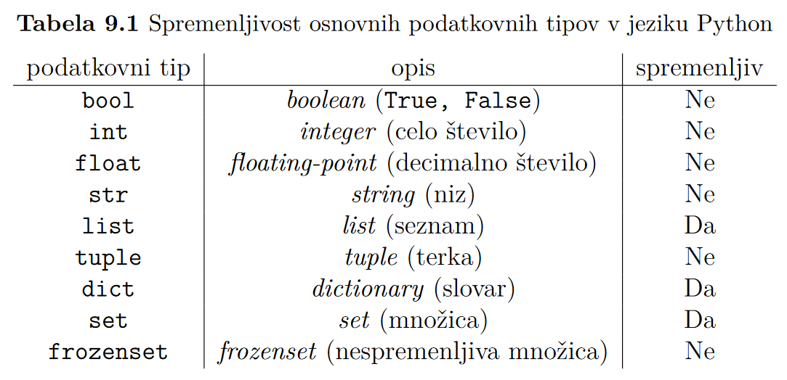

# Optional params, spremenljivost podatkovnih tipov, terke (tuple)
`def ime_funkcije(a, b, c=1, d=3, *rest)`  
.  




Če funkciji kot arg podamo **spremenljiv** podatkovni tip, ga funkcija **direktno spreminja** (shallow copy).  
**Nespremenljivih** podatkovnih tipov pa ne more spreminjati, zato naredi deep copy in spreminja tistega. Fajn je, če poj vrne spremenjeno vrednost.

```py
def samoglasniki(niz1, niz2):
    for crka in niz2:
        if crka.lower() in "aeiou":
            niz1 += crka
    return niz1
# sprememba niza se ne bo odražala.

niz1 = samoglasniki(niz1, niz2) # Spremeni niz1


# Spremenljivi podatkovni tip (seznam)
def pozitivni(sez1, sez2):
    for st in sez2:
        if st > 0:
            sez1.append(st)
#tale funkcija lahko vrača rezultat lahko pa ne, sprememba se odrazi v vsakem primeru


# če nočemo spremeniti vhodnega podatka, znotraj funkcije naredimo globoko kopijo
def pozitivni(sez1, sez2):
    sez1 = sez1.copy() ## deep copy
    for st in sez2:
        if st > 0:
            sez1.append(st)

```

## Terka
Podoba seznamu, a ni spremenljiva.
```py
# Vrednost damo v oklepaje, vsaj ena vejica
terka = (1,)
terka2 = (1, 2, 3)
prazna = tuple()
```
Terke navadno vsebujejo različne tipe podatkov (ime, visina, starost, najljubsa_crka)

### (Raz)pakiranje terke
```py
(a, b, c) = (1, 2, 3)
a, b, c = 1, 2, 3 # Oklepaji so optional

terka = zip(predmeti, ocene, leta)
#, where predmeti, ocene, leta ... seznami
```
Funkcija `zip(sez1, sez2 ...)` vrne seznam/iterable terk z istoležnimi elementi podanih seznamov.

```py
p = [(1,2,3), (4,5,6), (7,8,9)]
for a, b, c in p:
    print(a, b+c)
```
Dogovor: za podatke iz terke, ki jih ne rabimo, uporabimo `_`
```py
podatki = [("Poli", "SUP", 15), ("Bralec Polijevega Twitterja", "rdeč SUP", 99)]
for ime, _, _ in podatki:
    # ne rabaš SUP-a
    print(ime)
```